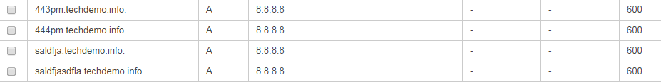

TechDemo.info is a project that uses python tornado to update an AWS Route53 domain as well as DynamoDB with information about the entries.  The site does not check the data entered (needs to be fixed). The site is also very basic when it comes to the html.

Route53 looks like this:

DynamoDB looks like this:
